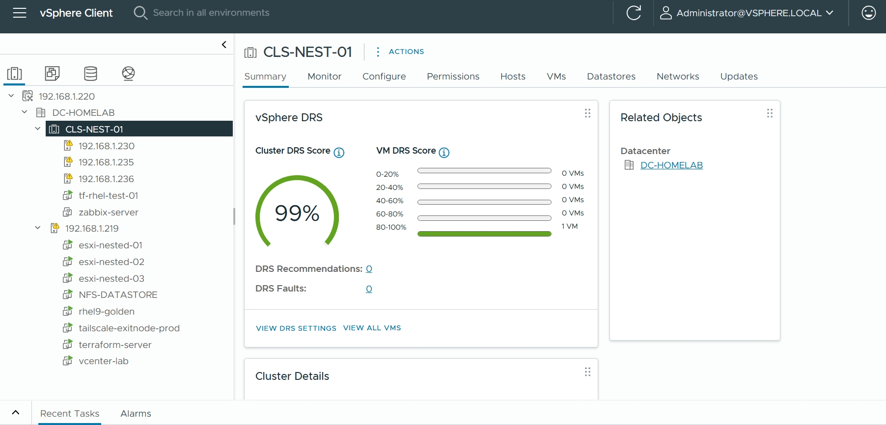

# 🏗️ vSphere Private Cloud Platform

  

A fully automated **Nested ESXi Lab** built on VMware vSphere.

---

## 📋 Project Overview
This project demonstrates the design, deployment, and operation of a self-hosted private cloud using nested virtualization on VMware vSphere.

The environment emulates an enterprise data center architecture, including a clustered hypervisor, centralized storage, virtual networking, automation pipelines, and Linux server infrastructure — all running on a single physical host.

---

## 🏛️ Architecture & Components
- **Hypervisor Layer**: Nested ESXi cluster (`CLS-NEST-01`)
- **Management Layer**: vCenter Server Appliance
- **Storage Layer**: NFS Datastore (`NFS-DATASTORE`)
- **Networking Layer**: Segmented networks (Management, vMotion, VM Network)
- **Automation Layer**: Dedicated control node running Terraform and Ansible
- **Guest OS**: Red Hat Enterprise Linux 9

---

## ⚙️ Automation Stack & Journey

### **Terraform** (Initial Approach)
Used for infrastructure provisioning via the vSphere API. However, a critical bug in the legacy `vmware/vsphere` v2.15 provider prevented reliable template cloning (VMs repeatedly booted with "Operating System not found").

### **Ansible** (Successful Path)
Migrated to Ansible's `community.vmware.vmware_guest` module, which proved stable and reliable for full template cloning and VM deployment. This repository preserves the full journey — from encountering the blocker to successfully pivoting to a working solution.

---

## 🚀 Execution Workflow
The primary workflow uses **Ansible** for reliable VM deployment.

1.  **Preparation**: Configure underlying physical ESXi host and networking.
2.  **Provisioning**: Use Ansible (`playbooks/deploy_vm.yml`) to deploy VMs from a template.
3.  **Configuration**: (Future Goal) Apply post-boot Ansible playbooks for OS hardening and application installation.
4.  **Validation**: Verify VM boot, networking, and functionality in vCenter.

---

## 🛠️ Challenges & Solutions

- **Challenge**: Terraform template cloning bug.
- **Solution**: Diagnosed that the provider was replacing the bootable OS disk with an empty one. Pivoted to Ansible for reliable deployment.

- **Challenge**: Legacy guest customization timeouts on RHEL 9.
- **Solution**: Adopted a clean, full-clone method in Ansible, deferring complex configuration to post-deployment plays.

---

## 📸 Screenshots
- [vCenter Inventory](screenshots/vcenter-inventory.png)
- [Deployed VM Console](screenshots/rhel9-console.png)
- [Ansible Playbook Execution](screenshots/ansible-run.png)

---

## 📚 Documentation
- [High-Level Architecture](docs/high-level.md)
- [Automation Guide](docs/automation.md)
- [Nested ESXi Lab Setup](lab/nested-esxi/)

---

## 🏆 Author

**Boye Adesemowo**
*Linux • Cloud • DevOps • Platform Engineering*
