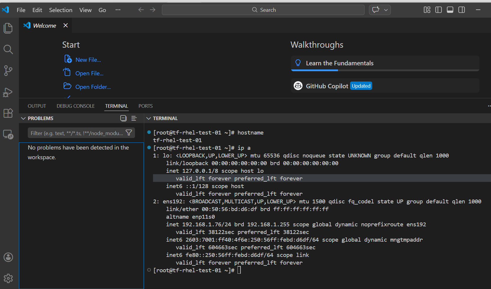
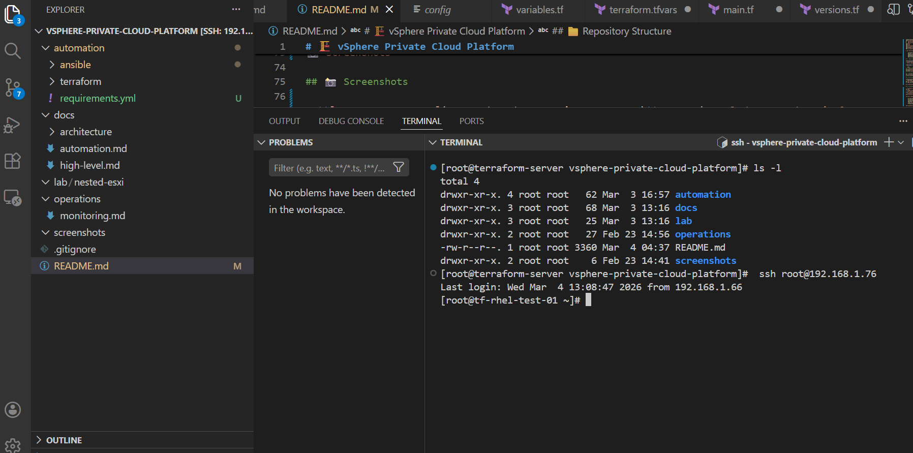
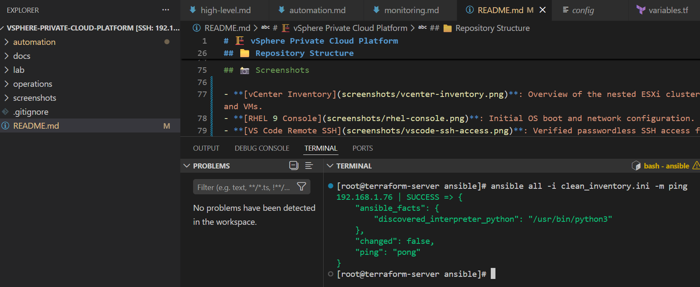

# 🏗️ vSphere Private Cloud Platform


A fully automated **Nested ESXi Lab** built on VMware vSphere using Terraform and Ansible.

---

## 📌 Project Goal

This project showcases the design, deployment, and automation of a self-hosted private cloud using nested virtualization.

It emulates enterprise data center architecture — including clustered hypervisors, centralized storage, segmented networking, automation pipelines, and monitoring — all running on a single physical host.

---

## 🛠️ Tech Stack


---

## 📁 Repository Structure

```bash
vsphere-private-cloud-platform/
├── automation/
│   ├── terraform/     # VM provisioning
│   └── ansible/       # OS & application configuration
├── docs/              # Architecture & guides
├── lab/               # Nested ESXi lab documentation
├── operations/        # Monitoring & operations
├── screenshots/       # Visual documentation
├── README.md
└── .gitignore

✨ Key Features

    Automated VM deployment from golden templates
    Secure first-boot configuration with Cloud-Init
    Idempotent configuration using Ansible
    Repeatable and version-controlled infrastructure
    Real-world troubleshooting documented

## 🚀 Quick Start

**Prerequisites:**
- Ensure SSH key-based authentication is configured for `root@192.168.1.76`.
- Verify connectivity: `ssh root@192.168.1.76 "hostname"`

**Deployment Steps:**

```bash
# 1. Deploy VM Infrastructure
cd automation/terraform
terraform init
terraform apply

# 2. Configure OS & Applications
cd ../ansible
ansible-playbook -i inventory.ini playbooks/deploy.yml

## ✅ Verification

Infrastructure access has been verified via secure SSH keys:
```powershell
PS> ssh root@192.168.1.76 "hostname"
tf-rhel-test-01

📸 Screenshots


## 📸 Screenshots

### vCenter Inventory – Nested ESXi Cluster

### RHEL Console
 *Initial OS boot and network configuration.*

### VS Code Remote SSH
 *Verified passwordless SSH access from your local workstation, you can administer all servers directly from VS Code, no clunky vSphere web console required.*

### Ansible Execution
 *Successful playbook run configuring Git and demo directories.*

🏆 Skills Demonstrated

    Virtualization Administration (vSphere, ESXi, Nested Virtualization)
    Infrastructure as Code (Terraform)
    Configuration Management (Ansible)
    Advanced Troubleshooting & Tool Migration
    Linux Systems Administration (RHEL 9)
    Professional Documentation & Version Control

📚 Documentation

    High-Level Architecture
    Automation Guide
    Nested ESXi Lab Setup

Built as a learning project to showcase real-world infrastructure automation and problem-solving.

Last updated: March 2025

Author: Boye Adesemowo
Focus: Linux • Cloud • DevOps • Platform Engineering

